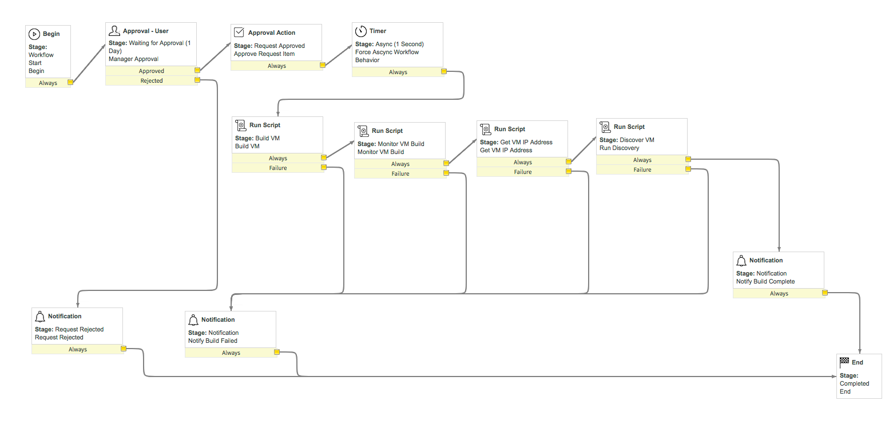
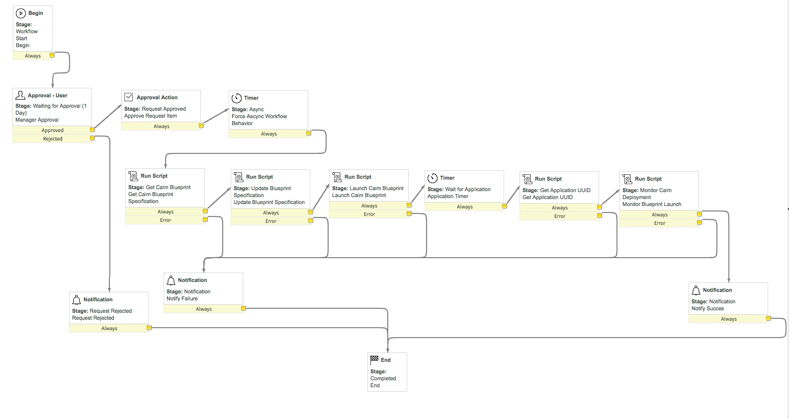
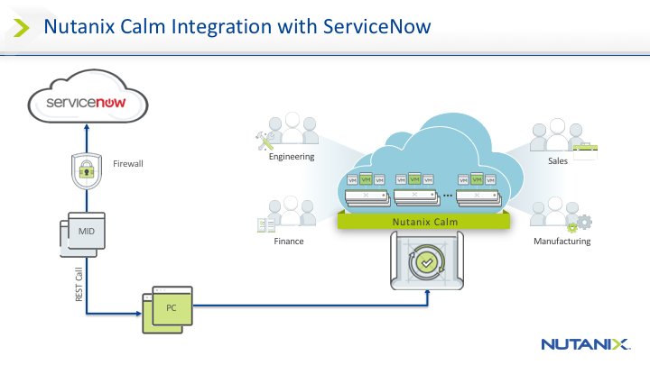

# ServiceNow
Community repository for ServiceNow integration with the Nutanix API

## Contents
  - [Features](#features)
  - [Disclaimer](#disclaimer)
  - [Components](#components)
    - [Artifacts](#artifacts)
    - [RunBook](#runbook)
  - [Usage](#usage)
  - [Architecture](#architecture)
  - [Communication](#communication)
  - [Known Limitations](#known-limitations)
  - [Video Demonstrations](#video-demonstrations)
  - [Development](#development)

## Features
Table based design to allow for simplified import and configuration. 
AD integration. 
Email notification from workflows for both success and failure conditions. 
Intetraged approvals within the workflows. 
Ability to view progress of the deployment in realtime via workflow stages. 
Nutanix Services catalog catagory to help organize the Nutanix specific catalog items within the ServiceNow Service Catalog. 

Features for all  catalog items:
* Dynamic loading of projects based on: 
  * Selected Prism Central instance 
  * Project membership of the current user

Features specific to individual catalog items:

* Nutanix VM Requests
  * Virtual Machine Deployment Integration with ServiceNow
  * Dynamic loading of networks based on selected project
  * Discovery of the deployed virtual machine for inclusion in CMDB 
* Nutanix Blueprint Requests
  * Calm Blueprint Deployment Integration with ServiceNow
  * Dynamic loading of Calm blueprints based on the selected project
  * Dynamic loading of Calm blueprint profiles based on the selected blueprint 

[Back to Contents](#contents)

## Disclaimer

The integrations provided here are __*not*__ production-grade and are provided to simply demonstrate functionality. Please be advised that these integrations may run and operate in a way that do not follow best practices and therefore need to be reviewed to ensure it meets your requirements.  

[Back to Contents](#contents)

## Components
### Artifacts
#### ServiceNow_NutanixSSP-Utilities.xml
The ServiceNow_NutanixSSP-Utilities.xml is an application that is scoped to the Global namespace. This allows the use of certain global utilities that can only be accessed from a globally scoped application to be accessed by applications scoped within other namespaces or contexts. This application file is required to be imported prior to the ServiceNow_NutanixSSP-Core.xml application file.

#### ServiceNow_NutanixSSP-Core.xml
The ServiceNow_NutanixSSP-Core.xml is, as the name implies, the core to the integration with the Nutanix platform. It is to be imported after all of the prerequisites have been satisfied. See the [Runbook](./ServiceNow_NutanixSSP-RunBook.docx) for more detail about the prerequisites.

### RunBook
#### ServiceNow_NutanixSSP-RunBook.docx
The ServiceNow_NutanixSSP-RunBook.docx contains the detailed instructions regarding the setup of the ServiceNow instance, prerequisites, detailed instructions about importing and configuring the applications.

[Back to Contents](#contents)

## Usage

The artifacts in this repository are meant to be used for demonstration and POC purposes only and should be deployed to a ServiceNow Developer Instance. You can learn more about Developer Instances and how to request them by going to the [ServiceNow Developers](https://developer.servicenow.com/) portal located at https://developer.servicenow.com/.

A detailed set of instructions on how to deploy the ServiceNow integration is documented in the [ServiceNow_NutanixSSP-RunBook.docx](./ServiceNow_NutanixSSP-RunBook.docx) file.

[Back to Contents](#contents)

## Architecture

The integrations leverage [Scoped Applications](https://docs.servicenow.com/bundle/kingston-application-development/page/build/applications/concept/c_ApplicationScope.html) in ServiceNow. This helps to provide a modular and transportable application which can be segregated from both the Global scope and other applications within ServiceNow. Each import file creates a scoped application when imported into a ServiceNow instance.

All communication is performed via REST calls through the mid server. See the [Communication Section](#communication) for more information.

All configuration is managed via tables within the NutanixSSP application. The tables are exposed via __Modules__ on the main menu when logged in as a system adminstrator to the ServiceNow instance. This allows for quick and simplified integration and configuration of the solution.

Within the ServiceNow instance, both client side and server side JavaScripting is used.

The two catalog items, __Nutanix VM Request__ and __Nutanix Blueprint Request__, both leverage client side __Catalog Client Scripts__ to load the dropdown boxes from the application tables local to the ServiceNow instance or from the Nutanix Prism Central instance depending on where the required data resides. The dropdowns are loaded based on whether the catalog page is loading or a component on that page has changed. If the required data is pulled from the Nutanix Prism Central instance, These scripts in turn call server side __Script Includes__ to make calls out to that instance via REST. When the item is ordered via the __Order Now__ button, the catalog item kicks off the appropriate workflow. For the __Nutanix VM Request__ catalog item the __VM Request Workflow__ is fired, for the __Nutanix Bluepirnt Request__ catalog item the __Blueprint Request Workflow__ is fired. Each of the workflows leverage server side __Script Includes__ to deploy the virtual machines or blueprints via REST.

Each of the workflows has a set of stages it goes through that correspond to the tasks that are executing within the workflow. This allows the workflow to be monitored in realtime as either the virtual machine or blueprint are being deployed.

#### Request VM Workflow Diagram

#### Request Blueprint Workflow Diagram

[Back to Contents](#contents)

## Communication

All communication between a ServiceNow instance and your internal network go through a [MID Server](https://docs.servicenow.com/bundle/kingston-servicenow-platform/page/product/mid-server/reference/r-MIDServer.html) which is deployed onto a server (Linux or Windows) on the internal network. The Mid Server initiates all communication with the ServiceNow instance for activities that it needs to perform internally on the network, such as Discovery or communication with a Prism Central instance. 

#### High Level Communication Overview Diagram

The integration between ServiceNow and Nutanix Calm has been built by leveraging the [Nutanix Prism Central v3 REST APIs](http://developer.nutanix.com/reference/prism_central/v3/). 

[Back to Contents](#contents)

## Known Limitations

#### Calm Blueprint Request
* The Calm Blueprint integration currently does not support the use of runtime variables. An alternative to runtime inputs is to create blueprint application profiles to cover the different permutations of the required inputs. For example, you could cover the runtime variables that modify the number of CPUs and memory by creating blueprint profiles for small, medium and large deployments with the appropriate CPU and memory settings defined within the profile. See the [Video Demonstrations](#video-demonstrations) section for the __Nutanix Calm Hybrid Cloud Deployments__ demo to view an example of how profiles can be leveraged.
* The Calm blueprint integration does not support blueprint versions.

#### PC VM Request
* The current VM request form does not support multiple VM’s in a single request.
* SysPrep or Cloud-Init is required.
* All VM management and deletion must be done through Nutanix SSP Portal.

[Back to Contents](#contents)

## Video Demonstrations
The __Nutanix Blueprint Request__ is covered in the [ServiceNow Integration with Nutanix Calm](https://www.youtube.com/watch?v=qNBbz8lYGKQ) Demo. 
You can find this video on YouTube at://www.youtube.com/watch?v=qNBbz8lYGKQ   
The __Nutanix VM Request__ is covered in the [ServiceNow Integration with Nutanix Prism Central](https://www.youtube.com/watch?v=Obysx2l5G1A) Demo. 
You can find this video on YouTube at: https://www.youtube.com/watch?v=Obysx2l5G1A   
To see a demo of profiles in use, check out the [Nutanix Calm Hybrid Cloud Deployments](https://www.youtube.com/watch?v=2LCC0ZdHDDE) demo. 
You can view this on YouTube at: https://www.youtube.com/watch?v=2LCC0ZdHDDE

[Back to Contents](#contents)

## Development

see [CONTRIBUTING.md](./CONTRIBUTING.md)

[Back to Contents](#contents)
